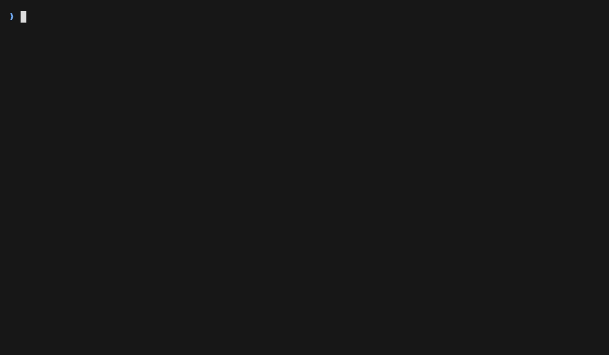
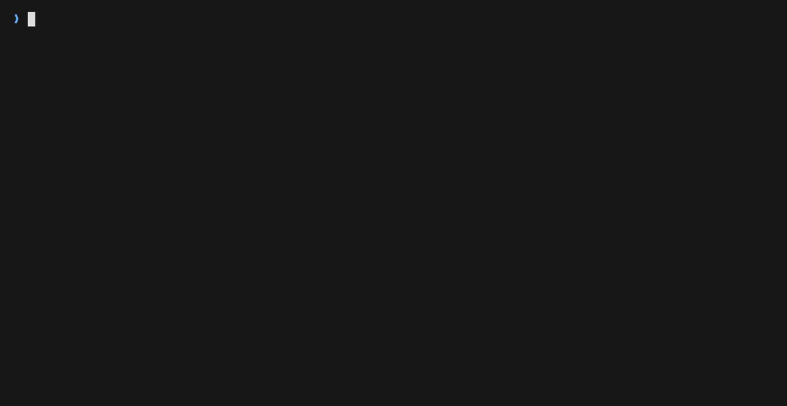
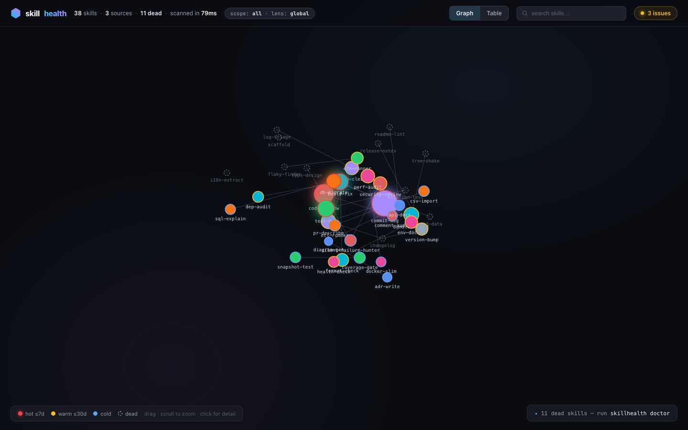

<div align="center">

# skillhealth

**flutter doctor for your agent skills — what you have, what you actually use, what's broken, and how it all connects.**

[](https://github.com/mirko-pira/skillhealth/actions/workflows/ci.yml)
[](./LICENSE-MIT)
[](https://www.rust-lang.org)
[](#tests)
[](#why)
[](#)
<!-- TODO(post-publish): add registry badges after first release:
[](https://crates.io/crates/skillhealth)
[](https://www.npmjs.com/package/skillhealth) -->

**[Demo](#demo)** · **[What it does](#what-it-does)** · **[Why](#why)** · **[Why a tool](#what-earns-a-dedicated-tool)** · **[Install](#install)** · **[Quickstart](#quickstart)** · **[How it works](#how-it-works)** · **[Benchmarks](#benchmarks)** · **[Flags](#flags)** · **[Keymap](#tui-keymap)** · **[Privacy](#privacy)** · **[Roadmap](#whats-next)** · **[License](#license)**

</div>

## Demo

<p align="center">
  
</p>

Everything on one screen. `skillhealth` ranks each installed skill by usage
heat (hot, warm, cold, or dead), computed from your real transcripts, next to
what it costs in tokens and a 12-week sparkline. Change a skill or transcript
while the cockpit is open and the list re-ranks itself; that's the dead
`regex-build` skill going hot on camera above. Press `d` for doctor: anything
broken becomes a finding with a *why* and a fix that `y` copies to your
clipboard.

Same data, scriptable: pipe it, `--json` it, gate CI on it.

<details>
<summary><b>See the plain, scriptable output</b> — overview, doctor, detail</summary>

<br>

<p align="center">
  
</p>

</details>

Both recordings are fully reproducible:
[`docs/demo/demo-tui.tape`](./docs/demo/demo-tui.tape) and
[`docs/demo/demo.tape`](./docs/demo/demo.tape) (VHS) over a synthetic
fixture environment ([`docs/demo/setup-demo.sh`](./docs/demo/setup-demo.sh)).

### The dashboard

<p align="center">
  
</p>

`skillhealth graph --open` shows the same portfolio as a map: each skill is a
node sized by usage and colored by heat, cross-references are edges, with a
doctor drawer and a sortable table view. Drag, zoom, `/` to filter, click a
node for its usage trend and connections. Past 100 nodes it warns you first
instead of rendering a hairball.

Skills pile up like dependencies. A few marketplace installs in, you're
carrying hundreds, and each one sits in your context window every session
whether it fires or not. skillhealth gives you one command to see the whole
pile and a pasteable fix for whatever's broken.

> **Status:** v0.2 — full test suite green, validated against a real 330-skill
> install and a 3.86 GB transcript corpus. Claude Code first; Codex and
> Gemini CLI are on the roadmap.

## What it does

- **Usage heat from your real transcripts** — hot / warm / cold / dead is
  computed from actual `Skill` invocations in your session transcripts
  (`~/.claude/projects/**/*.jsonl`), not guessed from file dates. You learn
  what you *actually* use.
- **Live cockpit** — run `skillhealth` bare in a terminal: full-screen TUI with
  heat-colored list, 12-week sparklines, doctor view, and auto-refresh when a
  skill or transcript changes. Pipes and CI keep the plain output.
- **Scope picker** — `--scope project|all|user` selects which skill roots to
  include; auto-detected as `project` when the repo has a `.claude/skills` dir,
  otherwise `all`. `p` in the TUI cycles scopes live.
- **Project lens** — `--lens project|global` filters usage heat and the doctor
  to the current project's transcripts only. `L` in the TUI toggles it.
- **Disabled-plugin awareness** — skills turned off via `enabledPlugins` get a
  dedicated `off` state: present on disk, never loaded, excluded from the
  always-on token total.
- **Cost split** — every skill shows `always_on` (loaded every session) vs
  `on_fire` (loaded only when invoked) token costs separately. The overview
  footer shows the always-on total across your portfolio.
- **Typed history cross-checks transcripts** — `history.jsonl` (Claude Code's
  own command log) is a second usage signal. Doctor finding W010 fires when a
  skill appears in history but has zero transcript hits — transcript rotation
  or a wrong `--projects-dir`, surfaced instead of silently understating heat.
- **Full discovery** — user skills (`~/.claude/skills`), project skills
  (`.claude/skills`, with walk-up: run it from any subdirectory of a repo),
  and marketplace plugins, with shadowing detection when the same name
  exists in two places.
- **Doctor with actionable fixes** — ten checks; every finding ships a
  *why*, and most carry a concrete *fix* you can paste into your shell.
  Doctor never edits anything itself.
- **Relationship graph** — edges are real cross-references (one skill's
  body mentioning another, CLAUDE.md wiring skills together), rendered as
  an interactive HTML dashboard, Mermaid, or JSON.
- **Detail view** — `skillhealth <name>`: invocation count, last used, the
  token cost split (always-on vs on-fire), source, connected skills, and
  findings for that one skill.
- **Fast** — parallel transcript scan with an incremental cache: ~3ms startup,
  ~50ms warm runs, ~0.5s per GB cold, measured on the 3.86 GB corpus above.
- **Scriptable** — `--json` everywhere with a stable schema, `--md` for a
  Markdown report with a Mermaid graph, semantic exit codes
  (`0` healthy · `1` warnings · `2` errors) so it drops straight into CI
  or a pre-commit hook.
- **Local only** — zero network, zero telemetry. Your transcript *content*
  never appears in any output — only invocation counts and timestamps.

## Why

Three concrete pains, from a real 330-skill install:

1. **Skills accumulate silently.** Plugins ship dozens at a time; nothing
   ever uninstalls them. Most people cannot answer "how many skills do I
   have?" within a factor of two — let alone "which ones fired this month?"
2. **Every skill costs context, every session.** Skill metadata is loaded
   into the context window whether the skill fires or not. Dead skills are
   pure tax: on the 330-skill install above, the never-fired skills alone
   burn ~18K tokens of context in every single session.
3. **Breakage is invisible.** A broken symlink, invalid frontmatter, or a
   CLAUDE.md trigger pointing at a deleted skill — the agent skips them
   silently. You find out never.

### Why not just open the folder?

Because the folder can't answer the questions that matter.
`ls ~/.claude/skills` shows you names — it doesn't know that a skill
hasn't fired since March, that its frontmatter stopped parsing two
updates ago, that CLAUDE.md still points at something you deleted, or
what the whole pile costs you in tokens, every single session.
skillhealth cross-references three sources — what's on disk, what your
transcripts say actually happened, and what CLAUDE.md promises — and
turns every delta into a fix you can paste.

## What earns a dedicated tool

Knowing which skills fire and which sit idle is the easy part. The useful job
is tying four things together:

- **Usage**: heat from real transcript invocations, not file dates.
- **Cost**: the always-on vs on-fire token split, so a dead skill shows up as
  what it costs you every session. The CLAUDE.md budget counts
  `@import`-expanded content, which a surface read misses.
- **Health**: a doctor where every finding has a *why* and a pasteable *fix*.
  It reports; it never edits your files.
- **Wiring**: which skills reference which, where CLAUDE.md triggers point,
  what's shadowed or orphaned.

All four in one pass, local, one static binary, with `--json` and semantic
exit codes so the same data drops into CI.

## Install

```bash
npx skillhealth          # zero install (real binaries, no Bun/Node runtime tricks)
# or
curl --proto '=https' --tlsv1.2 -LsSf https://github.com/mirko-pira/skillhealth/releases/latest/download/skillhealth-installer.sh | sh
# or
cargo install skillhealth
```

From source:

```bash
git clone https://github.com/mirko-pira/skillhealth
cd skillhealth
cargo install --path crates/skillhealth
```

## Quickstart

```bash
skillhealth                      # live cockpit: every skill, heat from real usage
skillhealth doctor               # diagnostics — every finding: why + pasteable fix
skillhealth graph --open         # interactive dashboard in the browser
skillhealth code-review          # one skill: usage, trend, connections, findings
```

Scriptable everywhere:

```bash
skillhealth --json | jq '.skills[] | select(.temperature == "dead") | .name'
skillhealth graph --format mermaid   # paste into any Markdown file
skillhealth doctor && echo "skills healthy"   # exit 0 / 1 warnings / 2 errors
```

## How it works

```
  ~/.claude/skills/      .claude/skills/        ~/.claude/plugins/
  user skills            project skills          marketplace plugins
        │                (walk-up from cwd)             │
        └──────────────────────┬────────────────────────┘
                               ▼
                         ┌──────────┐   CLAUDE.md (+ @import resolution)
                         │ discover │ ◄── trigger references, token budget
                         └────┬─────┘
                              ▼
                         ┌──────────┐   ~/.claude/projects/**/*.jsonl
                         │  parse   │   transcripts — invocation counts
                         └────┬─────┘   only, never content
                              ▼                │
                  ┌───────────┴──────┐         ▼
                  ▼                  ▼   ┌───────────┐
            ┌──────────┐      ┌───────┐ │ usage scan│──► incremental cache
            │  graph   │      │doctor │◄┤ (rayon)   │    (warm ≈ 50ms)
            └────┬─────┘      └───┬───┘ └───────────┘
                 └───────┬────────┘
                         ▼
       terminal · JSON · Markdown + Mermaid · HTML dashboard
```

| Layer | Crate | Owns |
|---|---|---|
| Core | `skillhealth-core` | discovery across all three roots (with shadowing + debris detection), frontmatter parsing (strict YAML with a lenient fallback — real-world SKILL.md files break strict parsers), parallel transcript scan with incremental cache, relationship graph, doctor checks, report model |
| CLI | `skillhealth` | clap-based binary, live TUI cockpit (ratatui), renderers (terminal, detail, doctor, JSON, Markdown/Mermaid), self-contained HTML dashboard embedded in the binary — no assets to fetch, works offline |

## Benchmarks

Measured on Apple Silicon against a real **330-skill install** and a **3.86 GB**
transcript corpus (`~/.claude/projects/**/*.jsonl`):

| Scenario | Time | What it covers |
|---|---|---|
| Startup, no scan | **~3 ms** | arg parse + discovery across all three roots |
| Warm run, cache hit | **~50 ms** | incremental cache valid; only changed transcripts re-read |
| Cold scan | **~0.5 s / GB** | full parallel transcript scan (rayon), empty cache |

Cold scan is the worst case — a first run, or right after the cache dir is
cleared. Steady state rides the incremental cache: each run only re-reads
transcripts whose mtime moved since the last scan, so it stays in the
tens-of-milliseconds range regardless of how large the corpus grows.

Reproduce on your own corpus:

```bash
hyperfine --warmup 3 'skillhealth --json'          # warm runs
skillhealth --cache-dir "$(mktemp -d)" --json      # force a cold scan
```

## Flags

| Flag | Description |
|---|---|
| `--scope project\|all\|user` | Which skill roots to include. Auto-detected as `project` when the repo has a `.claude/skills` dir; otherwise `all`. |
| `--lens project\|global` | Filter usage heat and doctor findings to the current project's transcripts (`project`) or the full corpus (`global`, default). |
| `--config-dir <path>` | Root for skills, plugins, CLAUDE.md, and `history.jsonl`. Defaults to `~/.claude`. |
| `--projects-dir <path>` | Root for transcript scanning. Decoupled from `--config-dir`; defaults to `~/.claude/projects`. |
| `--cache-dir <path>` | Where the incremental scan cache lives. Defaults to the OS cache dir. |

## TUI keymap

| Key | Action |
|---|---|
| `↑` `↓` / `j` `k` | Navigate skill list |
| `/` | Filter skills by name |
| `Enter` / `o` | Open SKILL.md in `$EDITOR` |
| `d` / `Tab` | Toggle doctor view |
| `y` | Copy the selected finding's fix to the clipboard (doctor) |
| `g` | Open the graph dashboard in the browser |
| `p` | Cycle scope (`project` → `all` → `user`) |
| `L` | Toggle lens (`global` ↔ `project`) |
| `s` / `S` | Sort list / group by source |
| `r` | Rescan now |
| `?` | Help |
| `q` / `Esc` | Back / quit |

## What doctor catches

- Broken or missing frontmatter (skills that will never load)
- Broken symlinks and debris directories in your skill roots
- Dead skills wasting context tokens in every session
- CLAUDE.md referencing skills that don't exist (drift)
- CLAUDE.md token budget — **including `@import` resolution** (most tools miss this)
- Shadowed skills (same name, two roots) and oversized skill bodies
- Usage data gaps — skill appears in typed history but has zero transcript hits (W010)

Every finding has a *why*; most also carry a copy-pasteable *fix*. Doctor reports;
**it never edits your files.**

## Use it from inside Claude Code

Copy the bundled skill and ask "audit my skills":

```bash
cp -r claude-skill/skillhealth ~/.claude/skills/
```

## Privacy

Local only. Zero network. Zero telemetry. The transcript scan extracts
invocation counts and timestamps — your transcript *content* never appears
in any output, including `--json`.

## What's next

skillhealth today is the single-player audit loop. Next, in rough order:

- **Skill lockfile** — content-hash every skill, flag what changed since
  the last audit. Marketplace updates stop being invisible.
- **Heat over time** — "went cold three weeks ago" or "this one is rising",
  not just today's snapshot.
- **Supply-chain scan** — static checks for prompt-injection and
  exfiltration patterns in skill bodies, *before* the agent reads them.

Longer-term: multi-runtime (Codex, Gemini CLI), an MCP server mode, and
org-level rollup. Built as they're needed, not promised on a schedule.

## Tests

```bash
cargo test                                  # unit + snapshot + e2e + PTY smoke
cargo fmt --check && cargo clippy --all-targets -- -D warnings
```

## License

[MIT](./LICENSE-MIT) OR [Apache-2.0](./LICENSE-APACHE) © 2026 Mirko Pira.
